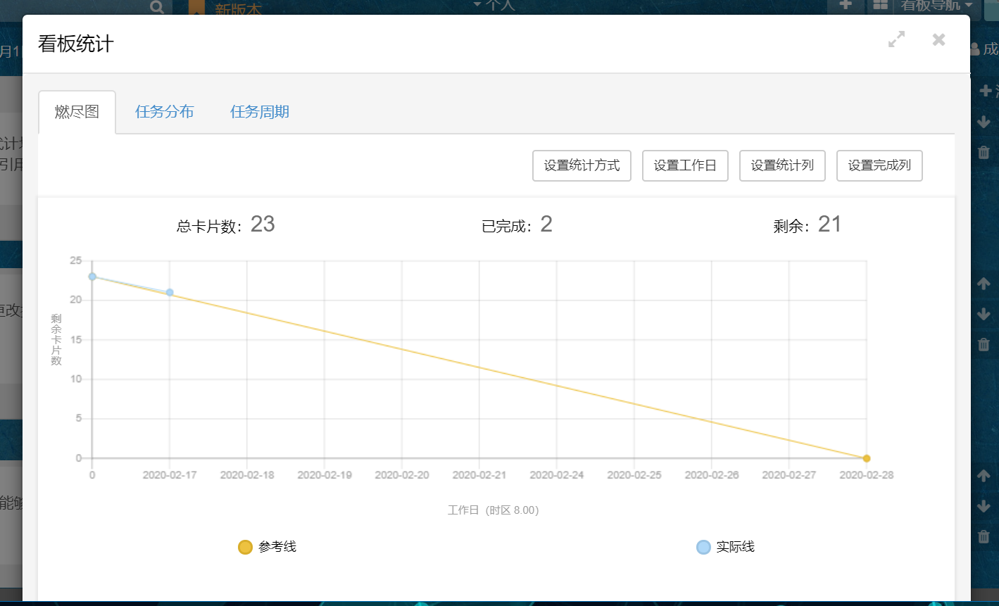

## 基于scrum的项目协作平台

### 1 简介

本平台面向使用Scrum框架进行开发的敏捷团队。将团队中常用的Scrum实践线上化。主要功能包括用户故事列表维护、故事看板、燃尽图、BUG管理等。按照敏捷的原则，工具要具有较高的可视化和易用性。为了兼顾不同用户的需求：计划开发基于ssm的Lite版以支持用户在局域网部署；计划开发基于springcloud分布式架构的Online版支持用户在互联网直接使用。

### 2 角色划分

按照Scrum框架，一个敏捷团队应包括以下三个角色

- 产品负责人（Product Owner）：产品所有者和团队成员一起工作，负责维护产品积压工作表(production backlog)，并对表中的项指定优先级
- Scrum主管（Scrum Master）：Scrum主管要和整个团队一同工作，帮助团队成员克服困难，保证项目正常运转。
- 开发团队

### 3 功能性需求（此处只介绍主要功能）

#### 3.1 项目构建

Scrum主管通过简单的操作即可完成线上的项目构建，包括：新建项目、邀请/导入成员、设置成员角色等CRUD操作

#### 3.2 维护积压工作表

产品负责人维护一份项目总体的积压工作表；此外，在每个Sprint周期，产品负责人从积压工作表中根据优先级来提取冲刺积压工作表。因此，此需求包括：积压工作表和冲刺积压工作表的CRUD等

#### 3.3 维护用户故事

在每次Sprint开始前，项目团队会对冲刺积压工作表中的特性进行拆分，产生用户故事。因此，此需求包括：从冲刺积压工作表中的特性中拆分用户故事以及用户故事列表的CRUD等

#### 3.4 可视化实时协作看板

应支持灵活的自定义看板结构，创建列表即可轻松定义工作流程，创建泳道可以对任务进行分组对应，拖动任务以体现工作进展，并实时同步看板信息。此外还应设置操作隔离，防止无关人员误触，具体需求可参照下图

#### 3.5 看板统计

系统应提供灵活多样的统计模式，方便团队成员了解到目前项目的进度，具体可参见下图

#### 3.6 BUG跟踪

每个BUG应直接依托于用户故事，测试人员对用户故事进行测试，若发现BUG即可用图片和文字进行描述，并将其提交至`BUGTRACE`模块，待开发人员修改结束后，可修改BUG状态。

若团队依赖于其他的`BUGTRACE`系统，也应提供方便的配置选项，以关闭此功能

#### 3.6 RankList

系统应根据用户故事的完成数量、有效工作时长、BUG率等，对团队中的开发者进行绩效排序。

但此功能违背Scrum自治团队的理论，因此应提供方便的配置选项，以关闭此功能

### 4 非功能性需求

1. 面向不同的客户群体，应提供支持局域网部署的版本和支持互联网开箱即用的版本。
2. 客户端主要为PC端浏览器，同时对移动端浏览器要有一定的适配。为降低开发成本，暂不开发桌面端和app端
3. 对于互联网版本，能够应对一定的高并发，最大响应时间应低于5秒
4. 对于局域网版本，应支持各种操作系统，尽可能简化部署流程，例如采用springboot实现一键部署、采用sqllite等内嵌数据库等。并且应为用户提供详实的部署文档帮助用户。
4. 为了与其他系统交互和支持日后的多前端，应提供REST风格的API接口
5. 系统要有较强的易用性，以符合敏捷原则

### 5 其他

可参考对比目前市面上的协作平台，如，[Leangoo](https://www.leangoo.com/)，[Trello](https://trello.com/)等