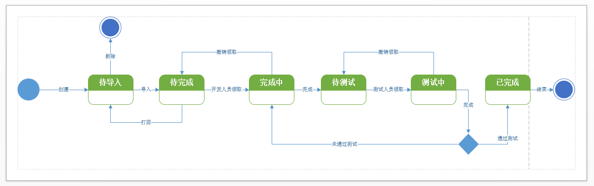

## 2 角色和功能列表

### 2.1 角色列表

### 2.2 功能列表

| 编号 | 模块      | 功能         | 功能描述                                                     | 角色 | 优先级 | 完成情况 |
| :--- | --------- | ------------ | ------------------------------------------------------------ | ---- | ------ | ---- |
| 1    | 登陆/注册 | 注册重名检查 | 当用户填写用户ID时，自动检测是否重名                         | 全部 | 3      | x   |
| 2    | 登陆/注册 | 注册         | 用户填写完注册表单。提交注册。若成功，用户收到注册成功后跳转到主界面（自动登陆）；若失败，用户查看到注册错误及具体错误信息。 | 全部 | 3      | x     |
| 3    | 登陆/注册 | 登陆         | 用户填写登陆表单，填写验证码。若成功，则用户进入到主菜单。若登陆失败，则用户查看到注册错误及具体错误信息。 | 全部 | 3      | x     |
| 4    | 个人信息  | 查看个人信息 | 用户查看个人信息表单                                         | 全部 | 2      | x     |
| 5   | 个人信息  | 编辑个人信息 | 用户开启编辑，编辑个人信息表单，提交，收到编辑成功或失败的消息 | 全部 | 2      | x     |
| 6   | 个人信息  | 申请加入项目     | 用户搜索项目，点击申请加入，提交，收到成功或失败的消息。然后等待该项目的主管审核                         | 全部 | 1      | x     |
| 7   | 个人信息  | 查看已申请     | 用户查看已申请项目                         | 全部 | 1      | x     |
| 8   | 个人信息  | 切换用户     | 用户点击切换用户，直接返回到登陆界面                         | 全部 | 3      | x     |
| 9   | 人员管理  | 查看全体人员 | 用户可查看当前项目下的所有人员的表格，表格的每行展示人员的重要信息以及人员的角色信息 | 主管 | 3      | x     |
| 10 | 人员管理 | 搜索人员 | 用户输入关键字，表格会按照用户的关键字呈现搜索到的人员 | 主管 | 2 | x |
| 11  | 人员管理  | 查看单个人员 | 用户选择某个人员，可查看到他的全部信息，包括他的角色信息、个人基本信息、与项目相关的信息等 | 主管 | 3      | x     |
| 12  | 人员管理  | 编辑单个人员 | 用户开启编辑，编辑人员信息表单，提交，收到编辑成功或失败的消息 | 主管 | 3      | x     |
| 13  | 人员管理  | 角色授予     | 用户开启角色授予编辑，勾选当前人员的角色，提交，收到成功或失败的消息。注：人员可以有多个角色 | 主管 | 3      | x     |
| 14  | 人员管理  | 删除人员     | 当用户查看全体人员的表格时，可以进行批量勾选，点击删除，收到成功或失败的消息。注：删除操作将会导致选中人员从项目中剔除，但人员的账号并不会被删除 | 主管 | 3      | x     |
| 15  | 人员管理  | 新增人员     | 用户点击新增，编辑人员表单+注册表单，提交，收到成功或失败的消息。成功后，用户可在人员列表中查看到这个人员 | 主管 | 3      | x     |
| 16  | 人员管理  | 批量新增     | 用户点击批量新增，上传一个csv文件，提交，收到针对文件中每个人员的成功和失败的消息 | 主管 | 1      | x     |
| 17  | 人员管理  | 邀请         | 用户点击邀请，并编辑人员角色信息，提交，收到成功或失败的消息。注意：邀请结束后需要被邀请者接受 | 主管 | 1      | x     |
| 18  | 人员管理  | 批量邀请     | 用户点击批量邀请，上传一个csv文件，提交，收到针对文件中每个人员的邀请成功和邀请失败的消息 | 主管 | 1      | x     |
| 19 | 项目管理 | 查看项目基本信息 | 用户可查看项目基本信息表单 | 全部 | 3 | x |
| 20 | 项目管理 | 编辑项目基本信息 | 用户开启编辑，编辑项目信息表单，提交，收到编辑成功或失败的消息 | 主管 | 2 | x |
| 21 | 积压工作表管理 | 查看项目积压工作表 | 用户可查看项目当前的积压工作表格，包括：编号、名称、描述、优先级、修改时间等 | 全部 | 3 | x |
| 22 | 积压工作表管理 | 查看单个积压工作 | 用户选择某个积压工作，可查看到它的全部信息，包括：编号、名称、描述、优先级、修改时间等 | 全部 | 3 | x |
| 23 | 积压工作表管理 | 新增积压工作 | 用户点击新增，填写积压工作**表单**，表单包括：编号、名称、描述、优先级、修改时间等信息，提交，收到成功或失败的消息 | 主管、拥有者 | 3 | x |
| 24 | 积压工作表管理 | 删除积压工作 | 当用户查看表格时，可以进行批量勾选，点击删除，收到成功或失败的消息。 | 主管、拥有者 | 3 | x |
| 25 | 积压工作表管理 | 编辑单个积压工作 | 用户开启编辑，编辑积压工作**表单**，提交，收到编辑成功或失败的消息 | 主管、拥有者 | 3 | x |
| 26 | 积压工作表管理 | 编辑积压工作优先级 | 用户开启编辑，上调或下调工作优先级，提交，收到成功或失败的消息 | 主管、拥有者 | 3 | x |
| 27 | 积压工作表管理 | 查看项目历史积压工作表 | 用户可查看项目已完成的积压工作表格，包括：编号、名称、描述、优先级、完成时间、迭代轮次等 | 全部 | 3 | x |
| 28 | 迭代管理 | 查看项目历史迭代表格 | 用户可查看项目全部已完成的迭代周期，包括：编号、名称、开始时间、结束时间、完成工作个数，未完成工作个数 | 全部 | 3 |  |
| 29 | 迭代管理 | 查看项目单个历史迭代 | 用户可查看某个迭代周期的详细信息，包括：迭代的基本信息和迭代中的积压工作表格 | 全部 | 3 |  |
| 30 | 迭代管理 | 查看当前迭代的积压工作表 | 用户查看当前迭代周期的积压工作表格 | 全部 | 3 |  |
| 31 | 迭代管理 | 新增积压工作 | 略 | 主管、拥有者 | 3 |  |
| 32 | 迭代管理 | 移除积压工作 | 略 | 主管、拥有者 | 3 |  |
| 33 | 迭代管理 | 查看积压工作对应的用户故事列表 | 用户查看表格时，点选可进入，进一步查看某个积压工作对应的用户故事拆分情况 | 全部 | 3 |  |
| 34 | 迭代管理 | 新建用户故事 | 用户填写用户故事表单，提交，查看成功或失败的结果。注：新建的用户故事不会直接进入用户故事看板的待完成区域，需要用户执行导入看板操作 | 主管、拥有者 | 3 |  |
| 35 | 迭代管理 | 删除用户故事 | 用户点选用户故事列表中的用户故事，点击删除，提交。注：并不是所有的用户故事都可以被删除，导入用户故事看板的用户故事不可被删除 | 主管、拥有者 | 3 |  |
| 36 | 迭代管理 | 修改用户故事 | 用户点选用户故事列表中的用户故事，点击修改，可以修改用户故事的具体文字描述 | 主管、拥有者 | 3 |  |
| 37 | 迭代管理 | 导入用户故事到看板 | 用户点选用户故事列表中的用户故事，点击导入到看板，可将用户故事导入到看板中的未完成区域 | 主管、拥有者 | 3 |  |
| 38 | 迭代管理 | 提前结束迭代 | 用户点击提前结束迭代，可以结束当前迭代。本轮迭代中的未完成工作状态将保存，未完成工作将回到积压工作表。当用户下一次添加时可恢复所有状态。 | 主管、拥有者 | 2 |  |
| 39 | 迭代管理 | 查看当前迭代的用户故事 | 用户可查看当前迭代产生的所有用户故事 | 主管、拥有者 | 1 |  |
| 40 | 迭代管理 | 开启新一轮迭代 | 若当前没有正在进行的迭代，用户可以开启新的迭代。填写迭代信息表单，包括开始日期和结束日期。从项目积压工作表中挑选工作创建本轮迭代的工作表，提交 | 主管、拥有者 | 3 |  |
| 41 | 用户故事看板 | 查看当前迭代的用户故事看板 | 用户可通过带泳道的用户故事看板，查看到当前迭代所有用户故事当前所处的状态 | 全部 | 3 |        |
| 42 | 用户故事看板 | 查看用户故事详情 | 基本信息，用户故事负责人信息，用户故事测试负责人信息，当前状态，bug清单等 | 全部 | 3 |        |
| 43 | 用户故事看板 | 领取用户故事 | 状态修改 | 开发者 | 3 |        |
| 44 | 用户故事看板 | 撤销领取 | 状态修改 | 对应用户故事的开发者 | 3 | |
| 45 | 用户故事看板 | 提交用户故事 | 状态修改 | 对应用户故事的开发者 | 3 |        |
| 46 | 用户故事看板 | 领取用户故事测试 | 状态修改 | 测试者 | 3 |        |
| 47 | 用户故事看板 | 撤销测试领取 | 状态修改 | 对应用户故事的测试者 | 3 | |
| 48 | 用户故事看板 | 完成用户故事 | 状态修改 | 对应用户故事的测试者 | 3 |        |
| 49 | 用户故事看板 | 打回用户故事 | 状态修改 | 对应用户故事的测试者 | 3 |        |
| 50 | BUG管理 | 查看BUG列表 | 查看当前迭代中的所有BUG | 全部 | 3 | |
| 51 | BUG管理 | 查看单个BUG | 查看当前迭代中的某个BUG | 全部 | 3 | |
| 50 | BUG管理 | 新建BUG | 用户搜索点选BUG对应的用户故事，填写BUG的文字描述、图片信息和文件等，点击提交，BUG进入待修改状态 | 测试者 | 3 |        |
| 51 | BUG管理 | 完成修改 | 状态修改 | 开发者 | 3 |        |
| 52 | BUG管理 | 复核通过 | 状态修改 | 测试者 | 3 |        |
| 53 | BUG管理 | 复核不通过 | 状态修改 | 测试者 | 3 |        |

### 2.3 用户故事状态机图

### 2.4 BUG状态机图

