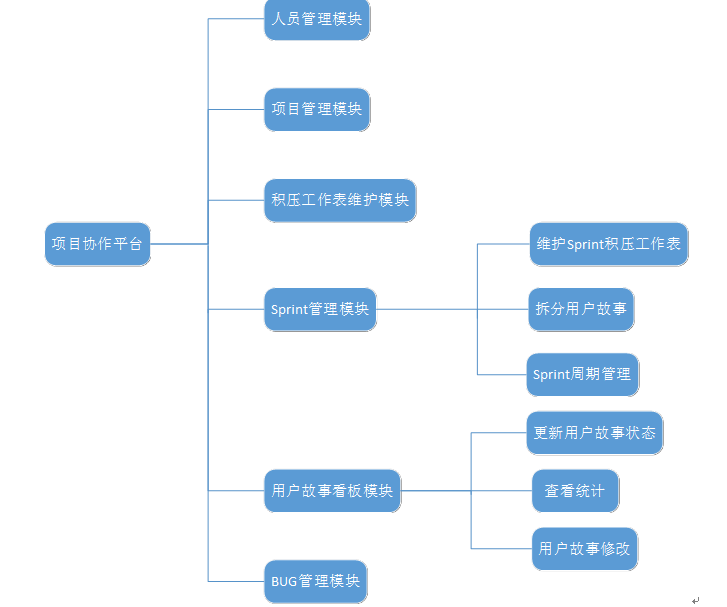
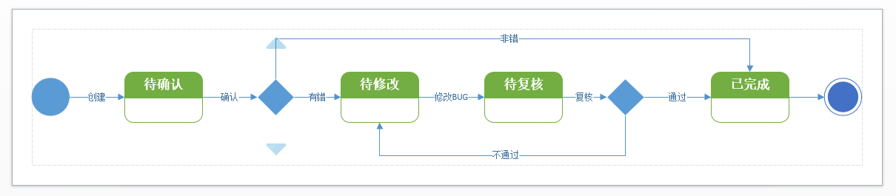

## 2 角色和功能列表

### 2.1 角色列表

| 编号 | 中文名称 | 英文名称  | 描述                                                         |
| ---- | -------- | --------- | ------------------------------------------------------------ |
| 1    | 主管     | master    | Scrum主管要和整个团队一同工作，帮助团队成员克服困难，保证项目正常运转。 |
| 2    | 所有者   | owner     | 产品所有者和团队成员一起工作，负责维护产品积压工作表(production backlog)，并对表中的项指定优先级 |
| 3    | 开发者   | developer | 项目中的普通开发人员，负责项目的具体设计和编码               |
| 4    | 测试者   | tester    | 项目中的普通测试人员，负责项目的黑盒测试                     |

### 2.2 功能列表

| 编号 | 模块         | 功能                           | 功能描述                                                     | 角色                 | 优先级 | 完成情况 |
| :--- | ------------ | ------------------------------ | ------------------------------------------------------------ | -------------------- | ------ | -------- |
| 1    | 登陆注册     | 注册重名检查                   | 当用户填写用户ID时，自动检测是否重名                         | 全部                 | 3      | x        |
| 2    | 登陆注册     | 注册                           | 用户填写完注册表单。提交注册。若成功，用户收到注册成功后跳转到主界面（自动登陆）；若失败，用户查看到注册错误及具体错误信息。 | 全部                 | 3      | x        |
| 3    | 登陆注册     | 登陆                           | 用户填写登陆表单，填写验证码。若成功，则用户进入到主菜单。若登陆失败，则用户查看到注册错误及具体错误信息。 | 全部                 | 3      | x        |
| 4    | 个人信息     | 查看个人信息                   | 用户查看个人信息表单                                         | 全部                 | 2      | x        |
| 5    | 个人信息     | 编辑个人信息                   | 用户开启编辑，编辑个人信息表单，提交，收到编辑成功或失败的消息 | 全部                 | 2      | x        |
| 6    | 个人信息     | 查看我的项目列表               | 用户可以查看自己加入的所有项目以及在此项目中的角色，点击具体项目条目时会查看这个项目的详细信息，详见功能19 | 全部                 | 2      | x        |
| xx   |              |                                |                                                              | 全部                 | 1      | x        |
| 7    | 个人信息     | 查看被邀请                     | 用户被邀请加入的项目                                         | 全部                 | 1      | x        |
| 8    | 个人信息     | 切换用户                       | 用户点击切换用户，直接返回到登陆界面                         | 全部                 | 3      | x        |
| 9    | 人员管理     | 查看全体人员                   | 用户可查看当前项目下的所有人员的表格，表格的每行展示人员的重要信息以及人员的角色信息 | 主管                 | 3      | x        |
| 10   | 人员管理     | 搜索人员                       | 用户输入关键字，表格会按照用户的关键字呈现搜索到的人员       | 主管                 | 2      | x        |
| 11   | 人员管理     | 查看单个人员                   | 用户选择某个人员，可查看到他的全部信息，包括他的角色信息、个人基本信息、与项目相关的信息等 | 主管                 | 3      | x        |
| 12   | 人员管理     | 搜索人员                       | 搜索本系统中所有的用户，它主要用于邀请                       | 主管                 | 3      | x        |
| 13   | 人员管理     | 角色授予                       | 用户开启角色授予编辑，勾选当前人员的角色，提交，收到成功或失败的消息。注：人员可以有多个角色 | 主管                 | 3      | x        |
| 14   | 人员管理     | 删除人员                       | 当用户查看全体人员的表格时，可以进行批量勾选，点击删除，收到成功或失败的消息。注：删除操作将会导致选中人员从项目中剔除，但人员的账号并不会被删除 | 主管                 | 3      | x        |
| xx   | 人员管理     | 新增人员                       | 用户点击新增，编辑人员表单+注册表单，提交，收到成功或失败的消息。成功后，用户可在人员列表中查看到这个人员 | 主管                 | 1      | x        |
| xx   | 人员管理     | 批量新增                       | 用户点击批量新增，上传一个csv文件，提交，收到针对文件中每个人员的成功和失败的消息 | 主管                 | 1      | x        |
| 17   | 人员管理     | 邀请                           | 用户点击邀请，并编辑人员角色信息，提交，收到成功或失败的消息。注意：邀请结束后需要被邀请者接受 | 主管                 | 1      | x        |
| xx   | 人员管理     | 批量邀请                       | 用户点击批量邀请，上传一个csv文件，提交，收到针对文件中每个人员的邀请成功和邀请失败的消息 | 主管                 | 1      | x        |
| 19   | 项目管理     | 查看项目基本信息               | 用户可查看项目基本信息表单                                   | 全部                 | 3      | x        |
| 20   | 项目管理     | 编辑项目基本信息               | 用户开启编辑，编辑项目信息表单，提交，收到编辑成功或失败的消息 | 主管                 | 2      | x        |
| 21   | 积压工作管理 | 查看项目积压工作表             | 用户可查看项目当前的积压工作表格，包括：编号、名称、描述、优先级、修改时间等 | 全部                 | 3      | x        |
| 21   | 积压工作管理 | 检索项目挤压工作表             | 用户可输入搜索词来检索项目当前的挤压工作                     | 全部                 | 3      |          |
| 22   | 积压工作管理 | 查看单个积压工作               | 用户选择某个积压工作，可查看到它的全部信息，包括：编号、名称、描述、优先级、修改时间等 | 全部                 | 3      | x        |
| 23   | 积压工作管理 | 新增积压工作                   | 用户点击新增，填写积压工作**表单**，表单包括：编号、名称、描述、优先级、修改时间等信息，提交，收到成功或失败的消息 | 主管、拥有者         | 3      | x        |
| 24   | 积压工作管理 | 删除积压工作                   | 当用户查看表格时，可以进行批量勾选，点击删除，收到成功或失败的消息。 | 主管、拥有者         | 3      | x        |
| 25   | 积压工作管理 | 编辑单个积压工作               | 用户开启编辑，编辑积压工作**表单**，提交，收到编辑成功或失败的消息 | 主管、拥有者         | 3      | x        |
| xx   | 积压工作管理 | 编辑积压工作优先级             | 用户开启编辑，上调或下调工作优先级，提交，收到成功或失败的消息 | 主管、拥有者         | 3      | x        |
| 27   | 积压工作管理 | 查看项目历史积压工作表         | 用户可查看项目已完成的积压工作表格，包括：编号、名称、描述、优先级、完成时间、迭代轮次等 | 全部                 | 3      | x        |
| 28   | 迭代管理     | 查看项目历史迭代表格           | 用户可查看项目全部已完成的迭代周期，包括：编号、名称、开始时间、结束时间、总工作个数，未完成工作个数 | 全部                 | 3      | x        |
| 29   | 迭代管理     | 查看项目单个历史迭代           | 用户可查看某个迭代周期的详细信息，包括：迭代的基本信息和迭代中的积压工作表格 | 全部                 | 3      | x        |
| 30   | 迭代管理     | 查看当前迭代的积压工作表       | 用户查看当前迭代周期的积压工作表格                           | 全部                 | 3      | x        |
| 31   | 迭代管理     | 新增积压工作                   | 用户从项目待完成的积压工作表中，选择积压工作，添加到当前迭代的积压工作表中 | 主管、拥有者         | 3      | x        |
| 32   | 迭代管理     | 移除积压工作                   | 用户从当前迭代的积压工作表中，选择积压工作，移动到待完成的积压工作表中 | 主管、拥有者         | 3      | x        |
| 33   | 迭代管理     | 查看积压工作对应的用户故事列表 | 用户查看表格时，点选可进入，进一步查看某个积压工作对应的用户故事拆分情况 | 全部                 | 3      | x        |
| 34   | 迭代管理     | 新建用户故事                   | 用户填写用户故事表单，其中包括用户故事耗时，提交，查看成功或失败的结果。注：新建的用户故事不会直接进入用户故事看板的待完成区域，需要用户执行导入看板操作 | 主管、拥有者         | 3      | x        |
| 35   | 迭代管理     | 删除用户故事                   | 用户点选用户故事列表中的用户故事，点击删除，提交。注：并不是所有的用户故事都可以被删除，导入用户故事看板的用户故事不可被删除 | 主管、拥有者         | 3      | x        |
| 36   | 迭代管理     | 修改用户故事                   | 用户点选用户故事列表中的用户故事，点击修改，可以修改用户故事的具体文字描述 | 主管、拥有者         | 3      | x        |
| 60   | 迭代管理     | 修改用户故事预估时间           | 用户修改用户故事预估时间                                     | 主管、拥有者         | 3      | x        |
| 37   | 迭代管理     | 导入用户故事到看板             | 用户点选用户故事列表中的用户故事，点击导入到看板，可将用户故事导入到看板中的未完成区域 | 主管、拥有者         | 3      | x        |
| 38   | 迭代管理     | 提前结束迭代                   | 用户点击提前结束迭代，可以结束当前迭代。本轮迭代中的未完成工作状态将保存，未完成工作将回到积压工作表。当用户下一次添加时可恢复所有状态。 | 主管、拥有者         | 2      | x        |
| 39   | 迭代管理     | 查看当前迭代的用户故事         | 用户可查看当前迭代产生的所有用户故事列表，包括：用户故事名称、预估时间、实际用时、是否超时、剩余BUG数、开发负责人、测试负责人等 | 主管、拥有者         | 1      | x        |
| 40   | 迭代管理     | 开启新一轮迭代                 | 若当前没有正在进行的迭代，用户可以开启新的迭代。填写迭代信息表单，包括开始日期和结束日期。从项目积压工作表中挑选工作创建本轮迭代的工作表，提交 | 主管、拥有者         | 3      | x        |
| 41   | 用户故事看板 | 查看当前迭代的用户故事看板     | 用户可通过带泳道的用户故事看板，查看到当前迭代所有用户故事当前所处的状态 | 全部                 | 3      | x        |
| 42   | 用户故事看板 | 查看用户故事详情               | 基本信息，用户故事负责人信息，用户故事测试负责人信息，当前状态，bug清单等 | 全部                 | 3      | x        |
| 43   | 用户故事看板 | 领取用户故事                   | 状态修改，待领取->完成中                                     | 开发者               | 3      | x        |
| 44   | 用户故事看板 | 撤销领取                       | 状态修改，完成中->待领取                                     | 对应用户故事的开发者 | 3      | x        |
| 45   | 用户故事看板 | 提交用户故事                   | 状态修改，完成中->待测试，填写花费时间                       | 对应用户故事的开发者 | 3      | x        |
| 46   | 用户故事看板 | 领取用户故事测试               | 状态修改，待测试->测试中，填写花费时间                       | 测试者               | 3      | x        |
| 47   | 用户故事看板 | 撤销测试领取                   | 状态修改，测试中->待测试，填写花费时间                       | 对应用户故事的测试者 | 3      | x        |
| 48   | 用户故事看板 | 完成用户故事                   | 状态修改，测试中->已完成，，填写花费时间。注：当用户故事有BUG需要修改时将停留在测试中区域 | 对应用户故事的测试者 | 3      | x        |
| 49   | 用户故事看板 | 打回用户故事                   | 状态修改，待完成->待领取                                     | 对应用户故事的测试者 | 3      | x        |
| 50   | BUG管理      | 查看BUG列表                    | 查看当前迭代中的所有BUG                                      | 全部                 | 2      | x        |
| 51   | BUG管理      | 查看单个BUG                    | 查看当前迭代中的某个BUG                                      | 全部                 | 2      | x        |
| 52   | BUG管理      | 新建BUG                        | 用户搜索点选BUG对应的用户故事，填写BUG的文字描述、图片信息和文件以及BUG评级，点击提交，BUG进入待修改状态 | 测试者               | 2      | x        |
| 53   | BUG管理      | 确认BUG有错                    | 状态修改 待确认->待修改                                      | 开发者               | 2      | x        |
| 54   | BUG管理      | 确认BUG无错                    | 状态修改 待确认->已完成                                      | 开发者               | 2      | x        |
| 55   | BUG管理      | 完成修改                       | 状态修改 待修改->待复核                                      | 开发者               | 2      | x        |
| 56   | BUG管理      | 复核通过                       | 状态修改 待复核->已完成                                      | 测试者               | 2      | x        |
| 57   | BUG管理      | 复核不通过                     | 状态修改 待复核->待修改                                      | 测试者               | 2      | x        |
| 58   | 看板统计     | 查看燃尽图                     | 用户查看本轮迭代的燃尽图                                     | 全部                 | 3      | x        |
| 59   | 看板统计     | 查看本轮仪表盘                 | 用户查看本轮迭代的仪表盘，包括剩余天数、已用时间、剩余时间、已完成的用户故事数量、未完成的用户故事数量、按时用户故事、超时用户故事，完成率(%)、现存BUG数量、已解决BUG数量等 | 全部                 | 3      | x        |
|      |              |                                |                                                              |                      |        |          |
|      |              |                                |                                                              |                      |        |          |
|      |              |                                |                                                              |                      |        |          |
|      |              |                                |                                                              |                      |        |          |

### 2.3 用户故事状态机图

### 2.4 BUG状态机图

